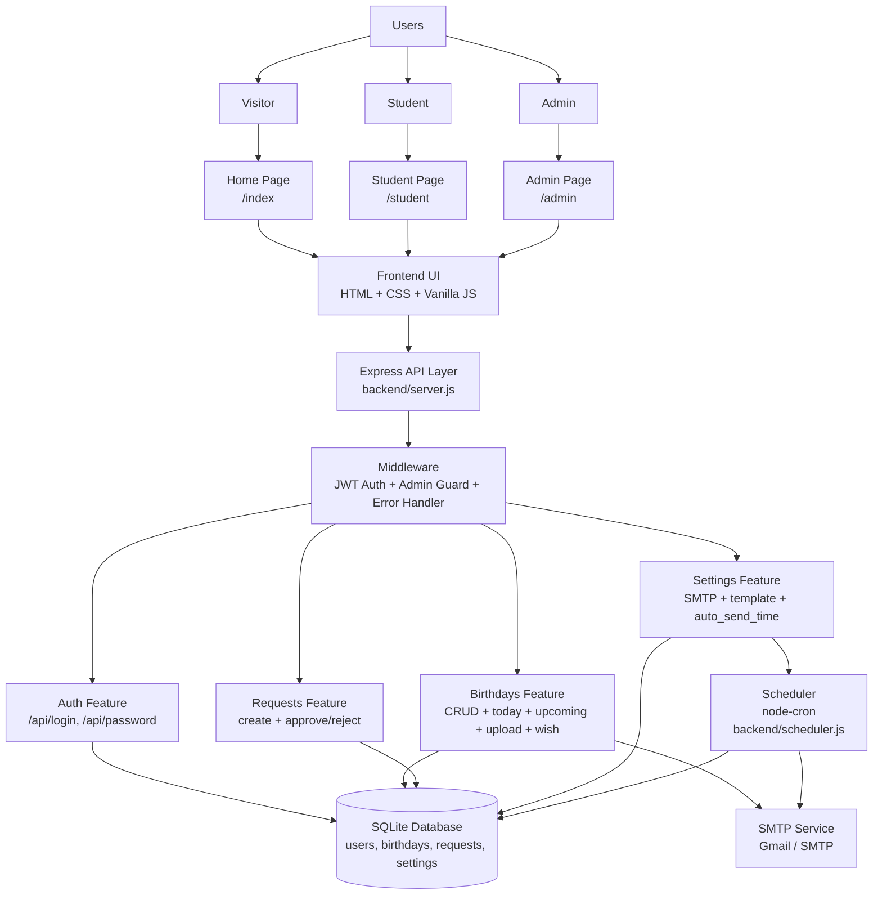

# Birthday Reminder - Block Diagram

```mermaid
flowchart TD
    U[Users]
    U1[Visitor]
    U2[Student]
    U3[Admin]

    FE[Frontend UI\nHTML + CSS + Vanilla JS]
    P1[Home Page\n/index]
    P2[Student Page\n/student]
    P3[Admin Page\n/admin]

    API[Express API Layer\nbackend/server.js]

    A1[Auth Feature\n/api/login, /api/password]
    A2[Birthdays Feature\nCRUD + today + upcoming + upload + wish]
    A3[Requests Feature\ncreate + approve/reject]
    A4[Settings Feature\nSMTP + template + auto_send_time]

    MID[Middleware\nJWT Auth + Admin Guard + Error Handler]

    DB[(SQLite Database\nusers, birthdays, requests, settings)]

    SCH[Scheduler\nnode-cron\nbackend/scheduler.js]
    SMTP[SMTP Service\nGmail / SMTP]

    U --> U1
    U --> U2
    U --> U3

    U1 --> P1
    U2 --> P2
    U3 --> P3

    P1 --> FE
    P2 --> FE
    P3 --> FE

    FE --> API

    API --> MID
    MID --> A1
    MID --> A2
    MID --> A3
    MID --> A4

    A1 --> DB
    A2 --> DB
    A3 --> DB
    A4 --> DB

    A2 --> SMTP
    A4 --> SCH
    SCH --> DB
    SCH --> SMTP
```
