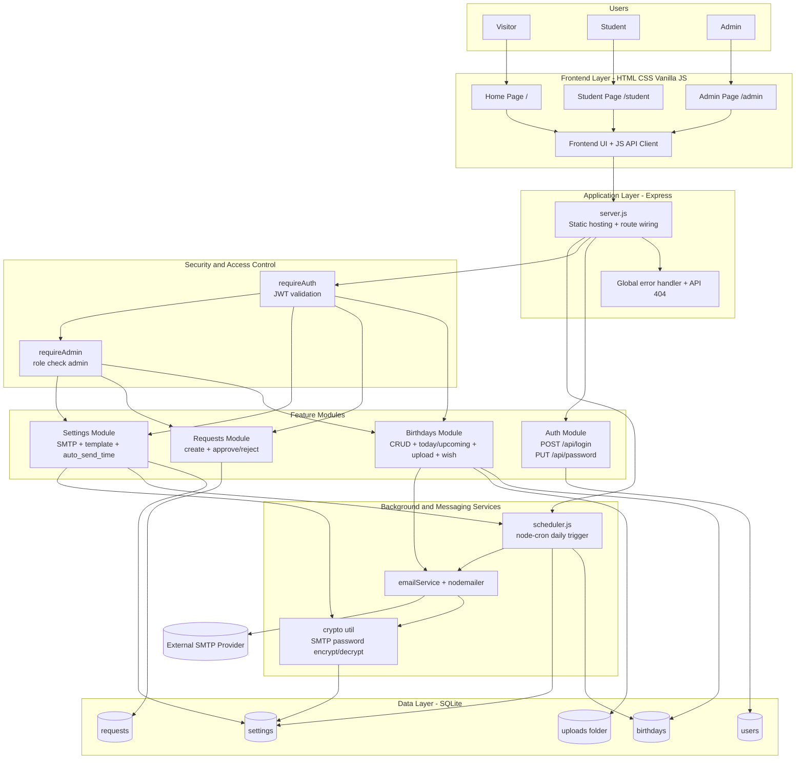

# Birthday Reminder - Detailed Block Diagram

```mermaid
flowchart TB
    %% User entry
    subgraph ACT[Users]
        direction LR
        Visitor[Visitor]
        Student[Student]
        Admin[Admin]
    end

    %% Frontend
    subgraph FE[Frontend Layer - HTML CSS Vanilla JS]
        direction LR
        Home[Home Page /]
        StudentPage[Student Page /student]
        AdminPage[Admin Page /admin]
        ApiClient[Frontend UI + JS API Client]
    end

    %% Express app entry
    subgraph APP[Application Layer - Express]
        direction LR
        Server[server.js\nStatic hosting + route wiring]
        ErrorHandler[Global error handler + API 404]
    end

    %% Access gates
    subgraph MW[Security and Access Control]
        direction LR
        RequireAuth[requireAuth\nJWT validation]
        RequireAdmin[requireAdmin\nrole check admin]
    end

    %% Feature modules
    subgraph MOD[Feature Modules]
        direction LR
        AuthMod[Auth Module\nPOST /api/login\nPUT /api/password]
        BirthdaysMod[Birthdays Module\nCRUD + today/upcoming + upload + wish]
        RequestsMod[Requests Module\ncreate + approve/reject]
        SettingsMod[Settings Module\nSMTP + template + auto_send_time]
    end

    %% Services
    subgraph SVC[Background and Messaging Services]
        direction LR
        Scheduler[scheduler.js\nnode-cron daily trigger]
        Mailer[emailService + nodemailer]
        Crypto[crypto util\nSMTP password encrypt/decrypt]
    end

    %% Data
    subgraph DBL[Data Layer - SQLite]
        direction LR
        Users[(users)]
        Birthdays[(birthdays)]
        Requests[(requests)]
        Settings[(settings)]
        Uploads[(uploads folder)]
    end

    SMTP[(External SMTP Provider)]

    %% User to frontend
    Visitor --> Home
    Student --> StudentPage
    Admin --> AdminPage

    %% Frontend to backend
    Home --> ApiClient
    StudentPage --> ApiClient
    AdminPage --> ApiClient
    ApiClient --> Server
    Server --> ErrorHandler

    %% Routing and guards (ordered to reduce edge crossing)
    Server --> AuthMod
    Server --> RequireAuth
    Server --> Scheduler

    RequireAuth --> BirthdaysMod
    RequireAuth --> RequestsMod
    RequireAuth --> SettingsMod
    RequireAuth --> RequireAdmin
    RequireAdmin --> BirthdaysMod
    RequireAdmin --> RequestsMod
    RequireAdmin --> SettingsMod

    %% Module to data/service
    AuthMod --> Users
    BirthdaysMod --> Birthdays
    RequestsMod --> Requests
    SettingsMod --> Settings
    BirthdaysMod --> Uploads
    BirthdaysMod --> Mailer

    %% Settings/scheduler/mail flow
    SettingsMod --> Scheduler
    SettingsMod --> Crypto
    Scheduler --> Birthdays
    Scheduler --> Settings
    Scheduler --> Mailer
    Mailer --> Crypto
    Crypto --> Settings
    Mailer --> SMTP
```
