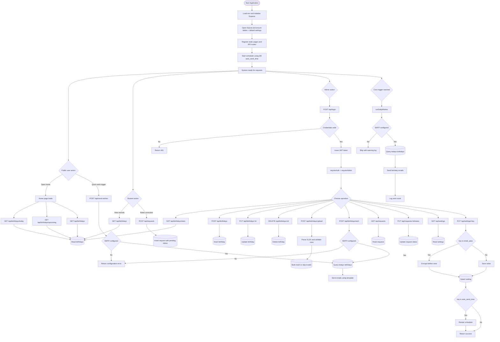

# Detailed Workflow Diagram

Last Updated: 2026-04-22



# Step-by-Step Workflow (Code-Aligned)

1. `backend/server.js` loads environment variables first and validates required `PORT`.
2. `backend/config/db.js` initializes SQLite schema (`users`, `birthdays`, `requests`, `settings`) and seeds defaults.
3. Express mounts static frontend files from `frontend/` and clean page aliases (`/`, `/admin`, `/student`).
4. API routes mount in this order: `/api` (auth), `/api/send-wishes`, `/api/birthdays`, `/api/requests`, `/api/settings`.
5. Public flows use `GET /api/birthdays`, `/today`, `/upcoming`, and `POST /api/requests`.
6. Admin login uses `POST /api/login`; successful login returns JWT stored by frontend in `localStorage`.
7. Admin-only operations are protected by `requireAuth` + `requireAdmin` middleware.
8. Birthday management includes CRUD, stats, XLSX upload, and `POST /api/birthdays/wish`.
9. Shortcut `POST /api/send-wishes` runs today-wish sending logic without requiring admin middleware.
10. Settings updates encrypt `email_pass` before save and restart scheduler when `auto_send_time` changes.
11. Scheduler time precedence is `auto_send_time` from DB, else `CRON_SCHEDULE`, else fallback `0 8 * * *` (IST).
12. Non-API unknown routes return `frontend/pages/404.html`; unknown API routes are forwarded to JSON error handler.

## Mounted API Entry Points

- POST /api/login
- PUT /api/password
- PUT /api/password
- POST /api/send-wishes (public shortcut)
- /api/birthdays/* (public read + admin write)
- /api/requests/* (public create + admin review)
- /api/settings/* (admin only)

## Route Protection Summary

Public:
- POST /api/login
- PUT /api/password
- GET /api/birthdays
- GET /api/birthdays/today
- GET /api/birthdays/upcoming
- POST /api/requests
- POST /api/send-wishes

Admin only:
- GET /api/birthdays/stats
- POST /api/birthdays
- PUT /api/birthdays/:id
- DELETE /api/birthdays/:id
- POST /api/birthdays/upload
- POST /api/birthdays/wish
- GET /api/requests
- PUT /api/requests/:id/status
- GET /api/settings
- PUT /api/settings/:key

## Current Structure Snapshot (excluding backend/node_modules)

```text
reminder/
|-- backend/
|   |-- config/
|   |   |-- db.js
|   |   \-- defaultTemplate.js
|   |-- features/
|   |   |-- auth/
|   |   |   |-- controller.js
|   |   |   \-- routes.js
|   |   |-- birthdays/
|   |   |   |-- controller.js
|   |   |   |-- crudHandlers.js
|   |   |   |-- emailService.js
|   |   |   |-- importHandlers.js
|   |   |   |-- routes.js
|   |   |   \-- wishHandlers.js
|   |   |-- requests/
|   |   |   |-- controller.js
|   |   |   \-- routes.js
|   |   \-- settings/
|   |       |-- controller.js
|   |       \-- routes.js
|   |-- middleware/
|   |   |-- authMiddleware.js
|   |   \-- errorHandler.js
|   |-- uploads/
|   |-- utils/
|   |   \-- crypto.js
|   |-- audit_db.js
|   |-- database.db
|   |-- kill.bat
|   |-- package-lock.json
|   |-- package.json
|   |-- print-settings.js
|   |-- scheduler.js
|   |-- server.js
|   \-- start.bat
|-- frontend/
|   |-- js/
|   |   |-- core/
|   |   |   |-- api/
|   |   |   |   |-- auth.js
|   |   |   |   |-- birthdays.js
|   |   |   |   |-- requests.js
|   |   |   |   |-- settings.js
|   |   |   |   \-- shared.js
|   |   |   |-- ui/
|   |   |   |   |-- init.js
|   |   |   |   |-- motion.js
|   |   |   |   |-- notifications.js
|   |   |   |   |-- runtime.js
|   |   |   |   \-- theme.js
|   |   |   |-- auth.js
|   |   |   \-- ui-utils.js
|   |   \-- pages/
|   |       |-- admin/
|   |       |   |-- requests.js
|   |       |   \-- settings.js
|   |       |-- admin.js
|   |       |-- home.js
|   |       \-- student.js
|   |-- pages/
|   |   |-- 404.html
|   |   |-- admin.html
|   |   |-- index.html
|   |   \-- student.html
|   |-- styles/
|   |   |-- features/
|   |   |   |-- components/
|   |   |   |   |-- advanced-ui.css
|   |   |   |   |-- cards-and-buttons.css
|   |   |   |   |-- feedback-and-lists.css
|   |   |   |   \-- forms-and-animations.css
|   |   |   |-- components.__source.css
|   |   |   \-- components.css
|   |   |-- pages/
|   |   |   |-- home/
|   |   |   |   |-- actions-and-background.css
|   |   |   |   |-- layout.css
|   |   |   |   \-- widgets-and-cards.css
|   |   |   \-- home-v2.css
|   |   \-- shared/
|   |       |-- tokens/
|   |       |   |-- base-layout.css
|   |       |   |-- headers-and-stats.css
|   |       |   \-- theme-tokens.css
|   |       \-- tokens-layout.css
|   \-- style.css
|-- .env
|-- .env.example
|-- .gitignore
|-- GEMINI.md
|-- PROJECT_FULL_REPORT.txt
|-- README.md
|-- render.yaml
|-- report.txt
|-- structure.txt
|-- workflow.md
\-- WORKING.md
```
