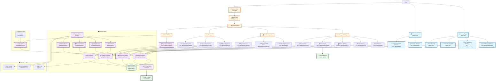

# Project Flow Diagram

```mermaid
flowchart TD
    %% User Entry Points
    User[👤 User] --> Home[🏠 Home Page<br/>index.html]
    User --> StudentPanel[🎓 Student Panel<br/>student.html]
    User --> AdminPanel[👨‍💼 Admin Panel<br/>admin.html]

    %% Home Page Flow
    Home --> FetchTodays[📡 Fetch Today's Birthdays<br/>GET /api/birthdays/today]
    Home --> FetchUpcoming[📡 Fetch Upcoming Birthdays<br/>GET /api/birthdays/upcoming]
    Home --> SendWish[📧 Send Individual Wish<br/>mailto: link]
    Home --> WishAll[📧 Wish All Today<br/>mailto: BCC]

    %% Student Panel Flow
    StudentPanel --> ViewAll[📋 View All Birthdays<br/>GET /api/birthdays]
    StudentPanel --> SubmitRequest[📝 Submit Correction Request<br/>POST /api/requests]

    %% Admin Panel Flow
    AdminPanel --> Login[🔐 Admin Login<br/>POST /api/login]
    Login --> JWT[🔑 JWT Token Issued]

    JWT --> ManageBirthdays[📅 Manage Birthdays]
    ManageBirthdays --> AddBirthday[➕ Add Birthday<br/>POST /api/birthdays]
    ManageBirthdays --> EditBirthday[✏️ Edit Birthday<br/>PUT /api/birthdays/:id]
    ManageBirthdays --> DeleteBirthday[🗑️ Delete Birthday<br/>DELETE /api/birthdays/:id]
    ManageBirthdays --> BulkImport[📤 Bulk Import<br/>POST /api/birthdays/upload]
    ManageBirthdays --> ExportCSV[📥 Export CSV<br/>GET /api/birthdays/export]

    JWT --> HandleRequests[📬 Handle Requests]
    HandleRequests --> ViewRequests[👀 View Pending Requests<br/>GET /api/requests]
    HandleRequests --> ApproveRequest[✅ Approve Request<br/>PUT /api/requests/:id/approve]
    HandleRequests --> RejectRequest[❌ Reject Request<br/>PUT /api/requests/:id/reject]

    JWT --> ConfigureSettings[⚙️ Settings]
    ConfigureSettings --> SMTPConfig[📧 SMTP Configuration<br/>PUT /api/settings/smtp]
    ConfigureSettings --> SchedulerConfig[⏰ Auto-Send Scheduler<br/>PUT /api/settings/scheduler]
    ConfigureSettings --> EmailTemplate[📝 Email Template Editor<br/>PUT /api/settings/template]

    JWT --> SendWishes[🎁 Send Wishes]
    SendWishes --> ManualSend[📤 Manual Send Today<br/>POST /api/send-wishes]
    SendWishes --> AutoSend[🤖 Auto Send<br/>Scheduled via cron]

    %% Backend Components
    subgraph Backend[🖥️ Backend Server]
        Server[🚀 Express Server<br/>server.js]
        Server --> AuthRoutes[🔐 Auth Routes<br/>authRoutes.js]
        Server --> BirthdayRoutes[📅 Birthday Routes<br/>birthdayRoutes.js]
        Server --> RequestRoutes[📬 Request Routes<br/>requestRoutes.js]
        Server --> SettingsRoutes[⚙️ Settings Routes<br/>settingsRoutes.js]

        AuthRoutes --> AuthController[🔐 Auth Controller<br/>authController.js]
        BirthdayRoutes --> BirthdayController[📅 Birthday Controller<br/>birthdayController.js]
        RequestRoutes --> RequestController[📬 Request Controller<br/>requestController.js]
        SettingsRoutes --> SettingsController[⚙️ Settings Controller<br/>settingsController.js]

        AuthController --> DB[(💾 SQLite Database<br/>better-sqlite3)]
        BirthdayController --> DB
        RequestController --> DB
        SettingsController --> DB

        BirthdayController --> SMTPSend[📧 SMTP Email Send<br/>nodemailer]
    end

    %% Middleware
    subgraph Middleware[🛡️ Security & Utils]
        AuthMiddleware[🔒 Auth Middleware<br/>authMiddleware.js]
        ErrorHandler[🚨 Error Handler<br/>errorHandler.js]
        CryptoUtils[🔐 Crypto Utils<br/>crypto.js]
    end

    Server --> AuthMiddleware
    Server --> ErrorHandler
    SettingsController --> CryptoUtils

    %% Scheduler
    subgraph Scheduler[⏰ Background Tasks]
        SchedulerJS[📅 Scheduler<br/>scheduler.js]
        SchedulerJS --> AutoSend
    end

    %% Data Flow
    FetchTodays --> BirthdayController
    FetchUpcoming --> BirthdayController
    AddBirthday --> BirthdayController
    EditBirthday --> BirthdayController
    DeleteBirthday --> BirthdayController
    BulkImport --> BirthdayController
    ViewRequests --> RequestController
    ApproveRequest --> RequestController
    RejectRequest --> RequestController
    SubmitRequest --> RequestController
    SMTPConfig --> SettingsController
    SchedulerConfig --> SettingsController
    EmailTemplate --> SettingsController
    ManualSend --> BirthdayController
    AutoSend --> BirthdayController

    %% External Services
    SMTPSend --> EmailProvider[📧 Email Provider<br/>Gmail/SMTP]
    BulkImport --> ExcelFile[📄 Excel/CSV File<br/>multer upload]

    %% Styling
    classDef public fill:#e1f5fe,stroke:#01579b,stroke-width:2px
    classDef protected fill:#fff3e0,stroke:#e65100,stroke-width:2px
    classDef backend fill:#f3e5f5,stroke:#4a148c,stroke-width:2px
    classDef data fill:#e8f5e8,stroke:#1b5e20,stroke-width:2px

    class Home,StudentPanel,ViewAll,SubmitRequest,FetchTodays,FetchUpcoming,SendWish,WishAll public
    class AdminPanel,Login,JWT,ManageBirthdays,HandleRequests,ConfigureSettings,SendWishes protected
    class Server,AuthRoutes,BirthdayRoutes,RequestRoutes,SettingsRoutes,AuthController,BirthdayController,RequestController,SettingsController,SMTPSend,AutoSend,ManualSend backend
    class DB,EmailProvider,ExcelFile data
```