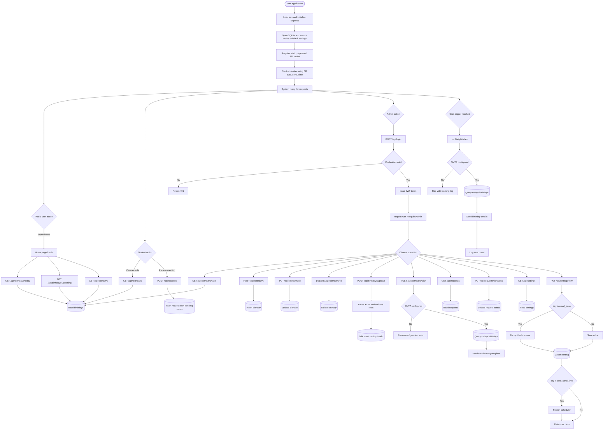

# Detailed Workflow Diagram

# Step-by-Step Workflow (Report Friendly)

1. Server boots, loads environment variables, and connects to SQLite.
2. Database tables are created or migrated: users, birthdays, requests, settings.
3. Default settings such as email template and auto_send_time are ensured.
4. Frontend pages are served at /, /student, and /admin.
5. Public users can view today, upcoming, and full birthday lists.
6. Students can submit correction requests to be reviewed by admins.
7. Admin logs in, receives JWT, and performs protected operations.
8. Admin manages birthdays, uploads Excel sheets, and sends manual wishes.
9. Admin settings update SMTP credentials, template, and dispatch time.
10. When auto_send_time changes, scheduler restarts with the new cron rule.
11. Daily scheduler checks todays birthdays and sends emails automatically.
12. Errors are returned as JSON for API routes and custom 404 is served for unknown pages.
