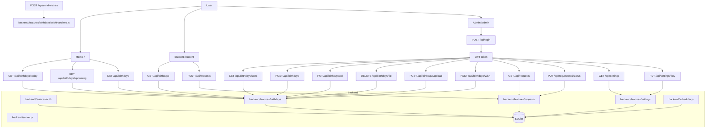

# Project Flow Diagram

```mermaid
flowchart TD
    User[User] --> Home[Home /]
    User --> Student[Student /student]
    User --> Admin[Admin /admin]

    Home --> H1[GET /api/birthdays/today]
    Home --> H2[GET /api/birthdays/upcoming]
    Home --> H3[GET /api/birthdays]

    Student --> S1[GET /api/birthdays]
    Student --> S2[POST /api/requests]

    Admin --> L1[POST /api/login]
    L1 --> JWT[JWT token]

    JWT --> A1[GET /api/birthdays/stats]
    JWT --> A2[POST /api/birthdays]
    JWT --> A3[PUT /api/birthdays/:id]
    JWT --> A4[DELETE /api/birthdays/:id]
    JWT --> A5[POST /api/birthdays/upload]
    JWT --> A6[POST /api/birthdays/wish]
    JWT --> A7[GET /api/requests]
    JWT --> A8[PUT /api/requests/:id/status]
    JWT --> A9[GET /api/settings]
    JWT --> A10[PUT /api/settings/:key]

    PublicSend[POST /api/send-wishes] --> WishHandlers[backend/features/birthdays/wishHandlers.js]

    subgraph Backend
      Server[backend/server.js]
      Auth[backend/features/auth]
      Birthdays[backend/features/birthdays]
      Requests[backend/features/requests]
      Settings[backend/features/settings]
      DB[(SQLite)]
      Scheduler[backend/scheduler.js]
    end

    H1 --> Birthdays
    H2 --> Birthdays
    H3 --> Birthdays
    S1 --> Birthdays
    S2 --> Requests
    A1 --> Birthdays
    A2 --> Birthdays
    A3 --> Birthdays
    A4 --> Birthdays
    A5 --> Birthdays
    A6 --> Birthdays
    A7 --> Requests
    A8 --> Requests
    A9 --> Settings
    A10 --> Settings

    Auth --> DB
    Birthdays --> DB
    Requests --> DB
    Settings --> DB
    Scheduler --> DB
```
